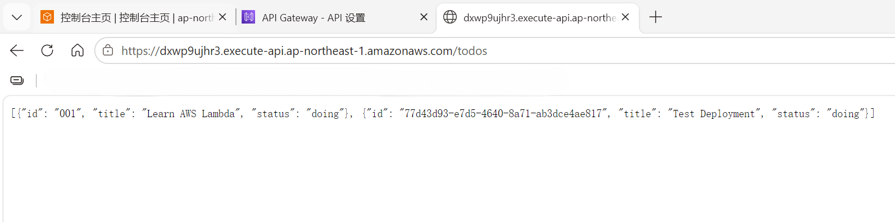

# AWS Serverless Todo API

A serverless REST API built with AWS Lambda, API Gateway and DynamoDB.

## Architecture

## Features

- GET /todos
- POST /todos
- DELETE /todos

## AWS Services

- Amazon API Gateway
- AWS Lambda
- Amazon DynamoDB
- Amazon CloudWatch
- IAM

## API Example

GET

/todos

POST

{
"title":"Learn AWS",
"status":"doing"
}

DELETE

{
"id":"todo-id"
}

## Deployment

Created using AWS Console.

## Lessons Learned

- Lambda execution role configuration
- DynamoDB CRUD operations
- API Gateway integration
- CloudWatch debugging
## Demo

GET /todos response:

