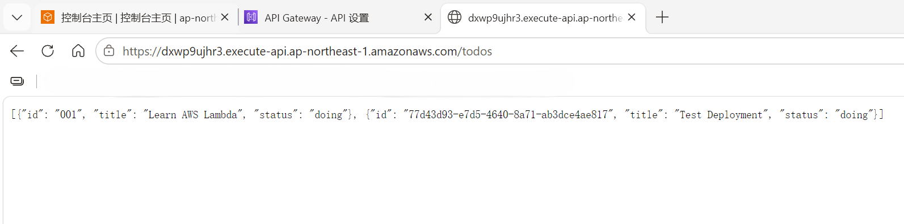

# AWS Serverless Todo API AWS 无服务器 Todo API

A serverless REST API built with AWS Lambda, API Gateway and DynamoDB.
一个基于 AWS Lambda、API Gateway 和 DynamoDB 构建的无服务器 REST API。

## Architecture 架构

## Features 功能

- GET /todos
- POST /todos
- DELETE /todos

## AWS Services AWS 服务

- Amazon API Gateway
- AWS Lambda
- Amazon DynamoDB
- Amazon CloudWatch
- IAM

## API Example API 示例

GET

/todos

POST

{
"title":"Learn AWS",
"status":"doing"
}

DELETE

{
"id":"todo-id"
}

## Deployment 部署

Created using AWS Console.
使用 AWS 控制台创建。

## Lessons Learned 经验总结

- Lambda execution role configuration
- Lambda 执行角色配置

- DynamoDB CRUD operations
- DynamoDB CRUD 操作

- API Gateway integration
- API Gateway 集成

- CloudWatch debugging
- CloudWatch 调试

## Demo 演示

GET /todos response（返回）:

